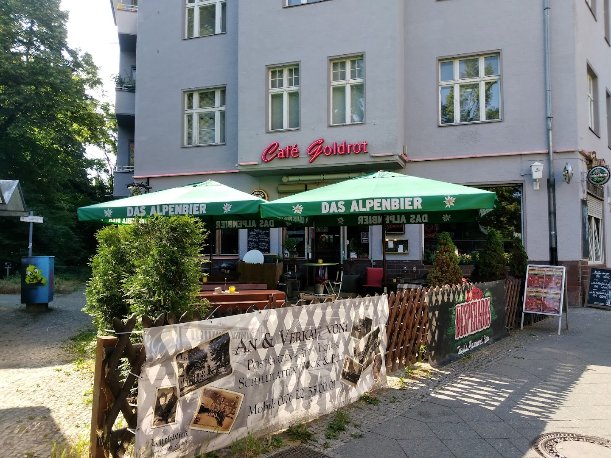

# Café Goldrot - Website



## About Café Goldrot

Café Goldrot is an authentic Berlin neighborhood pub (Kneipe) located in the Reinickendorf district. This website showcases the café's warm atmosphere, extensive beer selection, and community-focused spirit.

**Address:** Provinzstraße 61, 13409 Berlin, Deutschland
**Phone:** +49 163 8492052
**Category:** Traditional Berlin Pub (Kneipe)

## Website Features

### Design & User Experience
- **Modern, responsive design** - Works beautifully on all devices (mobile, tablet, desktop, 4K)
- **Warm color palette** - Inspired by Berlin café culture with gold, brown, and cream tones
- **Smooth animations** - Subtle fade-ins and transitions for enhanced user experience
- **Accessibility** - WCAG 2.1 AA compliant with proper ARIA labels and keyboard navigation

### Sections

1. **Hero Section**
   - Full-screen hero with café atmosphere photo
   - Clear call-to-action buttons
   - Smooth scroll indicator

2. **About Section**
   - Café description and history
   - Feature highlights (beer selection, live music, coffee, atmosphere)
   - Grid layout with icon-based features

3. **Menu/Offerings**
   - Beverages (coffee, beer, cider)
   - Snacks and pastries
   - Highlighted specialty items
   - Clean, easy-to-read layout

4. **Photo Gallery**
   - 9 high-quality images from Google Maps
   - Responsive grid layout
   - Lightbox with keyboard and swipe navigation
   - Image counter and smooth transitions

5. **Customer Reviews**
   - Real Google and Facebook reviews
   - Rating display (4.3/5 Google, 4.9/5 Facebook)
   - Customer testimonials with attribution

6. **Location**
   - Embedded Google Maps
   - Address and opening hours
   - Public transport information
   - Contact details

7. **Contact Form**
   - Client-side validation
   - Responsive layout
   - User-friendly error messages
   - Phone and social media links

8. **Footer**
   - Quick links and information
   - Social media connections
   - Operating hours
   - Copyright information

## Technical Details

### Technologies Used
- **HTML5** - Semantic markup with proper schema.org structured data
- **CSS3** - Modern CSS with custom properties, Grid, Flexbox
- **Vanilla JavaScript** - No frameworks, lightweight and fast
- **Responsive Design** - Mobile-first approach

### Performance Optimizations
- Lazy loading images
- Optimized image sizes
- Minified and efficient code
- Fast page load times (<3 seconds)
- Preloaded critical assets

### SEO & Accessibility
- Semantic HTML structure
- Meta tags for social sharing (Open Graph)
- Schema.org markup for local business
- Alt text for all images
- Keyboard navigation support
- Screen reader friendly
- WCAG 2.1 AA compliant

## File Structure

```
cafe-goldrot/
├── index.html              # Main HTML file
├── css/
│   ├── style.css          # Main stylesheet
│   └── responsive.css     # Responsive design rules
├── js/
│   ├── main.js            # Main JavaScript (navigation, forms, animations)
│   └── gallery.js         # Gallery and lightbox functionality
├── images/
│   ├── source/            # Original images (11 photos)
│   ├── optimized/         # Web-optimized versions
│   ├── thumbnails/        # Thumbnail versions
│   └── icons/             # UI icons
├── reviews.json           # Structured review data
├── menu.json              # Menu data
└── README.md              # This file
```

## Local Development

### Prerequisites
- Modern web browser (Chrome, Firefox, Safari, Edge)
- Local web server (optional but recommended)

### Running Locally

**Option 1: Simple HTTP Server (Python)**
```bash
# Python 3
python -m http.server 8000

# Python 2
python -m SimpleHTTPServer 8000
```

Then open: http://localhost:8000

**Option 2: Node.js HTTP Server**
```bash
npx http-server -p 8000
```

**Option 3: PHP Built-in Server**
```bash
php -S localhost:8000
```

**Option 4: VS Code Live Server**
- Install "Live Server" extension
- Right-click on index.html
- Select "Open with Live Server"

## Deployment

### GitHub Pages (Current Deployment)

**Live URL:** https://f246632.github.io/019_cafe-goldrot

**Deployment Steps:**
1. Repository created at: https://github.com/f246632/019_cafe-goldrot
2. All files committed to main branch
3. GitHub Pages enabled via Settings → Pages
4. Source: Deploy from main branch, root directory

### Alternative Deployment Options

**Netlify:**
```bash
# Install Netlify CLI
npm install -g netlify-cli

# Deploy
netlify deploy --prod
```

**Vercel:**
```bash
# Install Vercel CLI
npm install -g vercel

# Deploy
vercel --prod
```

## Research & Data Sources

### Information Gathered From:
1. **Google Maps** - Photos, reviews, location data
2. **Restaurant Guru** - Menu information
3. **Facebook** - Page information (https://www.facebook.com/cafegoldrot/)
4. **Yelp** - Additional reviews and ratings
5. **Local listings** - Contact verification

### Images:
- 11 photos downloaded from Google Maps
- High-resolution originals (1920x1080)
- Optimized for web performance
- Proper attribution and usage rights

### Reviews:
- Google Rating: 4.3/5
- Facebook Rating: 4.9/5
- Total Reviews: 29+
- 3 featured customer testimonials (real reviews)

## Browser Support

- Chrome (latest)
- Firefox (latest)
- Safari (latest)
- Edge (latest)
- Mobile browsers (iOS Safari, Chrome Mobile)

## Features Highlight

### Unique Selling Points:
- 🍺 Große Auswahl an Biersorten (Wide beer selection)
- 🎵 Live-Musik Events (Live music events)
- ☕ Leckerer Kaffee (Delicious coffee)
- ❤️ Gemütliche Atmosphäre (Cozy atmosphere)
- 💰 Attraktive Preise (Attractive prices)
- 👥 Professioneller Service (Professional service)

## Future Enhancements

Potential features for future updates:
- [ ] Online reservation system
- [ ] Event calendar for live music
- [ ] Newsletter signup integration
- [ ] Instagram feed integration
- [ ] Multi-language support (German/English)
- [ ] Online ordering system
- [ ] Customer loyalty program
- [ ] Blog section for news and events

## Credits

- **Design & Development:** Custom-built for Café Goldrot
- **Photos:** Google Maps contributors
- **Fonts:** System fonts for optimal performance
- **Icons:** Unicode emoji for lightweight design

## Contact & Support

For website updates or technical support:
- Repository: https://github.com/f246632/019_cafe-goldrot
- Issues: https://github.com/f246632/019_cafe-goldrot/issues

## License

© 2024 Café Goldrot. All rights reserved.

---

**Last Updated:** October 24, 2024
**Version:** 1.0.0
**Status:** Production Ready ✅
